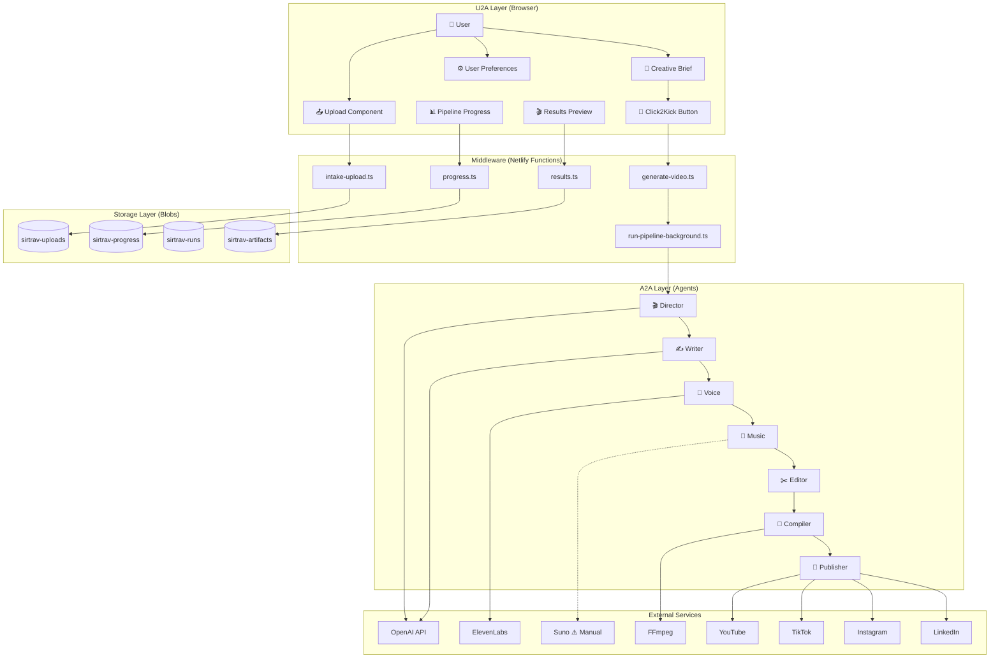
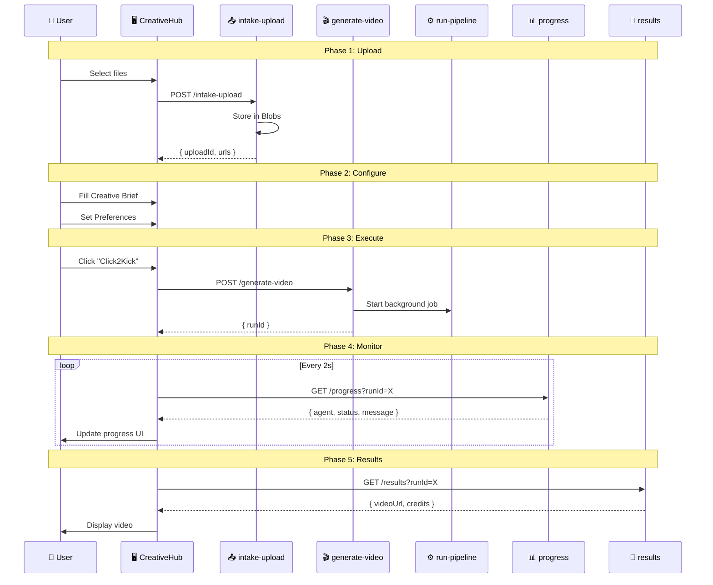
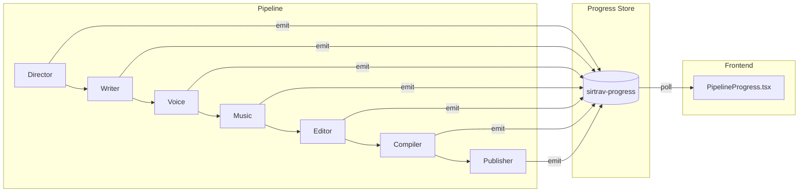
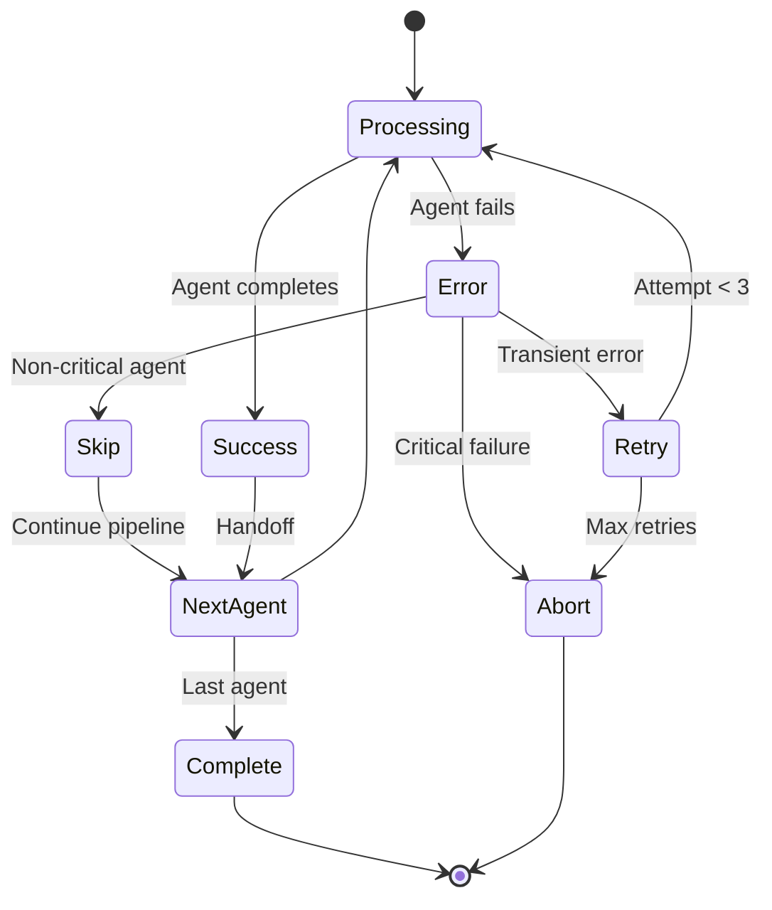

# SirTrav-A2A-Studio: U2A Flow Diagrams

> Visual reference for User-to-Agent and Agent-to-Agent communication flows.
> Version: 2.0.0 | Updated: January 3, 2026

---

## 1. High-Level System Architecture



---

## 2. U2A Request Flow (Sequence Diagram)



---

## 3. A2A Pipeline Flow

```
┌─────────────────────────────────────────────────────────────────────────────┐
│                          A2A PIPELINE EXECUTION                              │
├─────────────────────────────────────────────────────────────────────────────┤
│                                                                              │
│  ┌──────────┐    ┌──────────┐    ┌──────────┐    ┌──────────┐              │
│  │ DIRECTOR │───→│  WRITER  │───→│  VOICE   │───→│  MUSIC   │              │
│  │          │    │          │    │          │    │          │              │
│  │ • Vision │    │ • Script │    │ • TTS    │    │ • Suno   │              │
│  │ • Theme  │    │ • Caps   │    │ • Timing │    │ • BPM    │              │
│  └────┬─────┘    └────┬─────┘    └────┬─────┘    └────┬─────┘              │
│       │               │               │               │                     │
│       ▼               ▼               ▼               ▼                     │
│  ┌──────────────────────────────────────────────────────────┐              │
│  │                     SHARED CONTEXT                        │              │
│  │  • runId           • shotList        • audioUrl           │              │
│  │  • creativeBrief   • script          • musicUrl           │              │
│  │  • uploads         • voiceover       • timeline           │              │
│  └──────────────────────────────────────────────────────────┘              │
│       │               │               │               │                     │
│       ▼               ▼               ▼               ▼                     │
│  ┌──────────┐    ┌──────────┐    ┌──────────┐    ┌──────────┐              │
│  │  EDITOR  │←───│COMPILER  │←───│PUBLISHER │    │ COMPLETE │              │
│  │          │    │          │    │          │    │          │              │
│  │ • Curate │    │ • FFmpeg │    │ • Social │    │ • Video  │              │
│  │ • Sync   │    │ • Render │    │ • Links  │    │ • Credits│              │
│  └──────────┘    └──────────┘    └──────────┘    └──────────┘              │
│                                                                              │
└─────────────────────────────────────────────────────────────────────────────┘
```

---

## 4. Data Flow Architecture

```
INPUT                    PROCESSING                  OUTPUT
─────────────────────────────────────────────────────────────────

User Media               Director Agent              Shot List
┌──────────┐            ┌──────────────┐            ┌──────────┐
│ image.jpg│ ────────→  │ OpenAI Vision│  ────────→ │ shots[]  │
│ clip.mp4 │            │ correlate.ts │            │ theme    │
└──────────┘            └──────────────┘            └──────────┘
                              │
                              ▼
Creative Brief           Writer Agent               Script
┌──────────┐            ┌──────────────┐            ┌──────────┐
│ mood     │ ────────→  │   GPT-4      │  ────────→ │ script   │
│ audience │            │ narrate.ts   │            │ captions │
└──────────┘            └──────────────┘            └──────────┘
                              │
                              ▼
Script                   Voice Agent                Audio
┌──────────┐            ┌──────────────┐            ┌──────────┐
│ voiceover│ ────────→  │  ElevenLabs  │  ────────→ │ audio.mp3│
│ text     │            │ text-to-sp.ts│            │ timing[] │
└──────────┘            └──────────────┘            └──────────┘
                              │
                              ▼
Mood + Duration          Music Agent                Music
┌──────────┐            ┌──────────────┐            ┌──────────┐
│ upbeat   │ ────────→  │ Suno Prompt  │  ────────→ │ music.mp3│
│ 30s      │            │ generate-m.ts│  (manual)  │ bpm, key │
└──────────┘            └──────────────┘            └──────────┘
                              │
                              ▼
All Assets               Editor Agent               Timeline
┌──────────┐            ┌──────────────┐            ┌──────────┐
│ shots    │ ────────→  │ Beat Sync    │  ────────→ │ timeline │
│ audio    │            │ curate-m.ts  │            │ effects  │
│ music    │            └──────────────┘            └──────────┘
└──────────┘                  │
                              ▼
Timeline                 Compiler Agent             Video
┌──────────┐            ┌──────────────┐            ┌──────────┐
│ timeline │ ────────→  │   FFmpeg     │  ────────→ │ video.mp4│
│ json     │            │ compile-v.ts │            │ thumb.jpg│
└──────────┘            └──────────────┘            └──────────┘
                              │
                              ▼
Video + Meta             Publisher Agent            Links
┌──────────┐            ┌──────────────┐            ┌──────────┐
│ video.mp4│ ────────→  │  Social APIs │  ────────→ │ youtube  │
│ title    │            │ publish-*.ts │            │ tiktok   │
│ hashtags │            └──────────────┘            │ instagram│
└──────────┘                                        │ linkedin │
                                                    └──────────┘
```

---

## 5. Progress Event Flow



### Progress Event Schema

```typescript
interface ProgressEvent {
  runId: string;
  timestamp: string;
  agent: 'director' | 'writer' | 'voice' | 'music' | 'editor' | 'compiler' | 'publisher';
  status: 'started' | 'processing' | 'complete' | 'error';
  step: number;      // Current step within agent
  totalSteps: number;
  message: string;   // Human-readable status
  metadata?: {
    duration?: number;    // Processing time ms
    artifacts?: string[]; // Generated blob keys
    error?: string;       // Error details if failed
  };
}
```

---

## 6. User Preferences & Memory Flow

```
┌─────────────────────────────────────────────────────────────────┐
│                    USER PREFERENCES FLOW                         │
├─────────────────────────────────────────────────────────────────┤
│                                                                  │
│  ┌────────────────┐                                             │
│  │ First Visit    │                                             │
│  │ (No prefs)     │                                             │
│  └───────┬────────┘                                             │
│          │                                                       │
│          ▼                                                       │
│  ┌────────────────┐     ┌─────────────────┐                     │
│  │ Onboarding     │────→│  LocalStorage   │                     │
│  │ Survey Modal   │     │  (client-side)  │                     │
│  └────────────────┘     └────────┬────────┘                     │
│          │                       │                               │
│          │                       ▼                               │
│          │              ┌─────────────────┐                     │
│          └─────────────→│ Creative Brief  │                     │
│                         │ (pre-filled)    │                     │
│                         └────────┬────────┘                     │
│                                  │                               │
│                                  ▼                               │
│                         ┌─────────────────┐                     │
│                         │ generate-video  │                     │
│                         │ (includes prefs)│                     │
│                         └────────┬────────┘                     │
│                                  │                               │
│                                  ▼                               │
│                         ┌─────────────────┐                     │
│                         │ Director Agent  │                     │
│                         │ (uses prefs for │                     │
│                         │  style hints)   │                     │
│                         └─────────────────┘                     │
│                                                                  │
└─────────────────────────────────────────────────────────────────┘
```

---

## 7. Error Handling & Recovery



### Error Categories

```typescript
enum ErrorCategory {
  TRANSIENT = 'transient',     // Retry automatically
  RECOVERABLE = 'recoverable', // Skip and continue
  CRITICAL = 'critical',       // Abort pipeline
  USER_ERROR = 'user_error'    // Inform user
}

// Example: Voice agent fails
{
  agent: 'voice',
  error: 'ElevenLabs rate limit',
  category: 'transient',
  recovery: 'Retry in 60s'
}

// Example: Compile fails
{
  agent: 'compiler',
  error: 'FFmpeg not available',
  category: 'critical',
  recovery: 'Use test video fallback'
}
```

---

## 8. Publishing Flow (Multi-Platform)

```
┌─────────────────────────────────────────────────────────────────┐
│                    PUBLISHING PIPELINE                           │
├─────────────────────────────────────────────────────────────────┤
│                                                                  │
│  Final Video                                                     │
│  ┌──────────────┐                                               │
│  │  video.mp4   │                                               │
│  │  thumbnail   │                                               │
│  │  title       │                                               │
│  │  description │                                               │
│  │  hashtags    │                                               │
│  └──────┬───────┘                                               │
│         │                                                        │
│         ├────────────────────────────────────────┐               │
│         │                                        │               │
│         ▼                                        ▼               │
│  ┌──────────────┐                      ┌──────────────┐         │
│  │   YouTube    │                      │   TikTok     │         │
│  │              │                      │              │         │
│  │ • 16:9 video │                      │ • 9:16 video │         │
│  │ • Description│                      │ • 60s max    │         │
│  │ • Tags       │                      │ • Hashtags   │         │
│  └──────────────┘                      └──────────────┘         │
│         │                                        │               │
│         │                                        │               │
│         ▼                                        ▼               │
│  ┌──────────────┐                      ┌──────────────┐         │
│  │  Instagram   │                      │   LinkedIn   │         │
│  │              │                      │              │         │
│  │ • Reels 9:16 │                      │ • Video post │         │
│  │ • Stories    │                      │ • B2B focus  │         │
│  │ • Caption    │                      │ • Company pg │         │
│  └──────────────┘                      └──────────────┘         │
│                                                                  │
│  Output: { youtube: "url", tiktok: "url", ... }                 │
│                                                                  │
└─────────────────────────────────────────────────────────────────┘
```

---

## 9. Real-Time Updates (WebSocket Alternative)

Since Netlify Functions don't support WebSocket, we use **polling with Blobs**:

```
┌─────────────────────────────────────────────────────────────────┐
│                    POLLING-BASED PROGRESS                        │
├─────────────────────────────────────────────────────────────────┤
│                                                                  │
│  Browser                    Netlify Functions      Blobs Store  │
│  ┌──────┐                   ┌──────────────┐      ┌──────────┐  │
│  │      │                   │              │      │          │  │
│  │ Poll │ ──────────────→   │ progress.ts  │ ───→ │ get()    │  │
│  │ /2s  │                   │              │      │          │  │
│  │      │ ←──────────────   │              │ ←─── │          │  │
│  └──────┘     JSON          └──────────────┘      └──────────┘  │
│                                                                  │
│  Meanwhile, pipeline agents write progress:                      │
│                                                                  │
│  ┌──────────┐              ┌──────────────┐      ┌──────────┐   │
│  │ Director │ ───────────→ │emit('started')│ ───→│  set()   │   │
│  │ Agent    │              │              │      │          │   │
│  └──────────┘              └──────────────┘      └──────────┘   │
│                                                                  │
└─────────────────────────────────────────────────────────────────┘

// Frontend polling hook (useProgress.ts)
useEffect(() => {
  const interval = setInterval(async () => {
    const res = await fetch(`/.netlify/functions/progress?runId=${runId}`);
    const data = await res.json();
    setProgress(data);
    if (data.status === 'complete' || data.status === 'error') {
      clearInterval(interval);
    }
  }, 2000);
  return () => clearInterval(interval);
}, [runId]);
```

---

## 10. Complete Request Lifecycle

```
┌─────────────────────────────────────────────────────────────────────────────┐
│                         COMPLETE REQUEST LIFECYCLE                           │
├─────────────────────────────────────────────────────────────────────────────┤
│                                                                              │
│  T+0s    User clicks "Click2Kick"                                           │
│          │                                                                   │
│          ▼                                                                   │
│  T+0.1s  POST /generate-video { uploads, brief, prefs }                     │
│          │                                                                   │
│          ▼                                                                   │
│  T+0.2s  generate-video → Returns { runId } → Spawns background job         │
│          │                                                                   │
│          ▼                                                                   │
│  T+1s    Director Agent starts → OpenAI Vision analyzes uploads             │
│          │                                                                   │
│          ▼                                                                   │
│  T+5s    Director complete → Writer Agent starts → GPT-4 generates script   │
│          │                                                                   │
│          ▼                                                                   │
│  T+10s   Writer complete → Voice Agent starts → ElevenLabs TTS              │
│          │                                                                   │
│          ▼                                                                   │
│  T+20s   Voice complete → Music Agent starts → Suno prompt generated        │
│          │                                      (manual step if needed)      │
│          ▼                                                                   │
│  T+25s   Music complete → Editor Agent starts → Timeline assembly           │
│          │                                                                   │
│          ▼                                                                   │
│  T+30s   Editor complete → Compiler Agent starts → FFmpeg render            │
│          │                                                                   │
│          ▼                                                                   │
│  T+60s   Compiler complete → Publisher Agent starts → Social upload         │
│          │                                                                   │
│          ▼                                                                   │
│  T+90s   Publisher complete → Final results available                       │
│          │                                                                   │
│          ▼                                                                   │
│  T+90s   GET /results → { videoUrl, credits, publishLinks }                 │
│                                                                              │
└─────────────────────────────────────────────────────────────────────────────┘
```

---

*This document provides visual reference for the SirTrav-A2A-Studio architecture. For implementation details, see [U2A_ARCHITECTURE.md](./U2A_ARCHITECTURE.md).*
